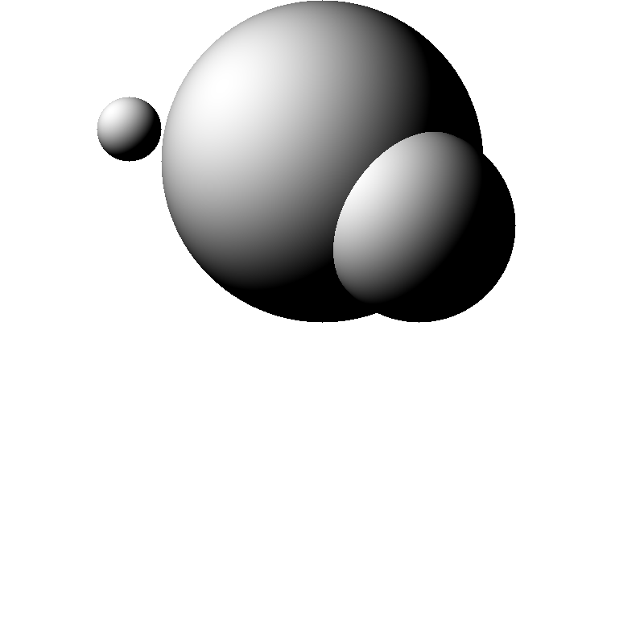
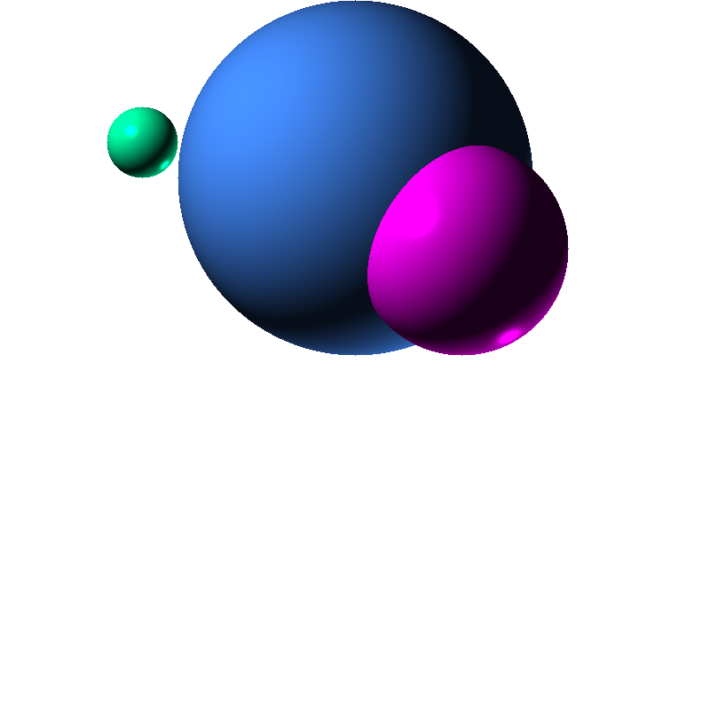
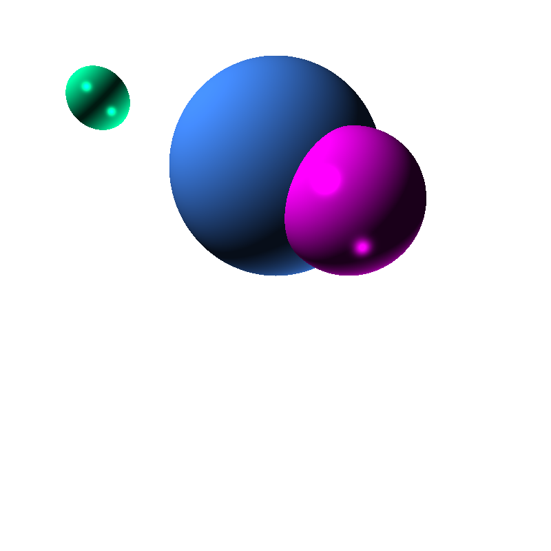
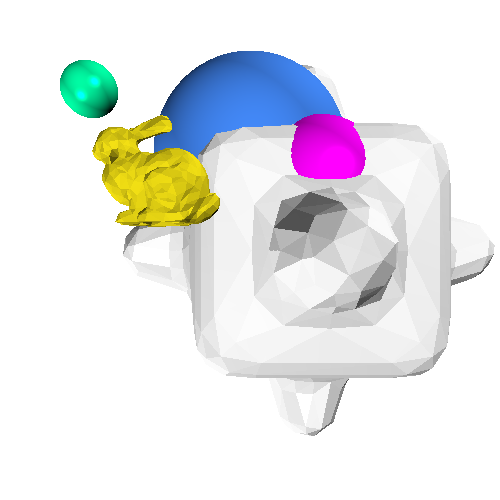
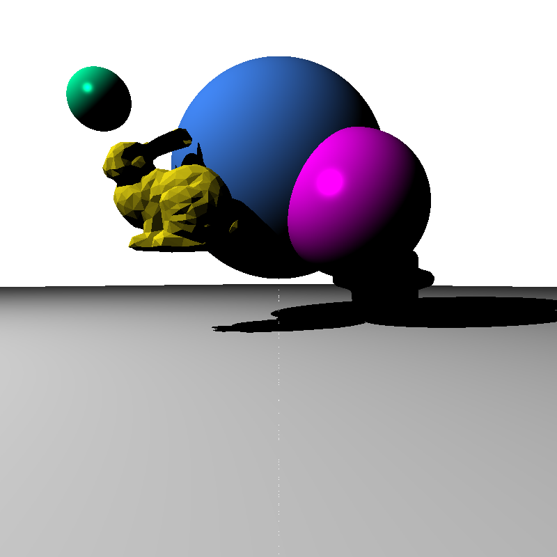
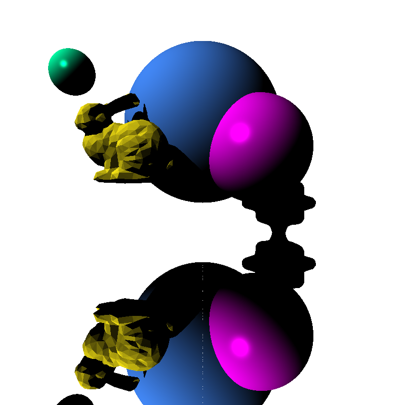
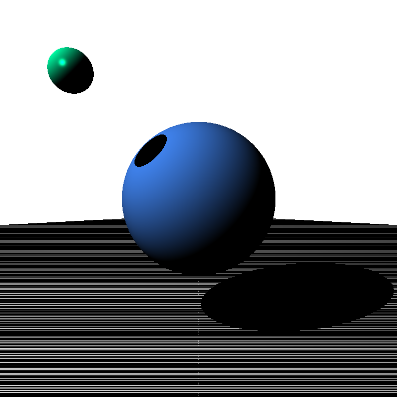
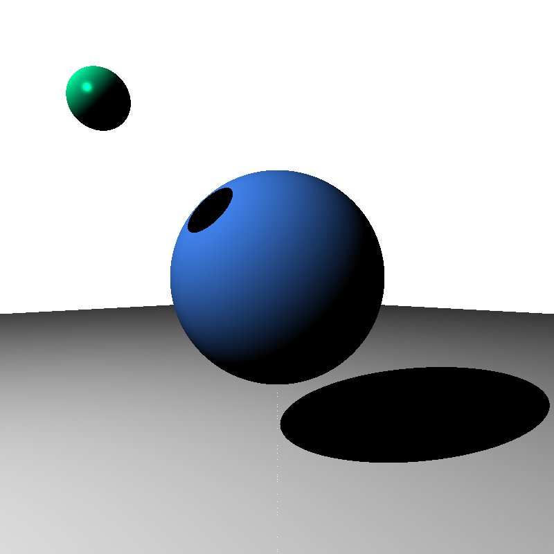

# Shading Spheres - Orthographic Projection

# Ambient, Diffuse, and Specular Lighting - Orthographic Projection

# Perspective Projection

# Triangular Meshes

# Shadows

# Ground Plane Mirror

# Challenges

Eigen doesn't seem to have a clear way of casting a matrix of a row directly into a VectorXd.

Eigen's cross product function `x.cross(y)` doesn't work unless you `#include <Eigen/Geometry>`. The error message for not doing just mentions that you are using the wrong data type, which doesn't exactly help beginners. After hours of Googling, Eigen's common pitfalls webpage came up (https://eigen.tuxfamily.org/dox/TopicPitfalls.html#title4).

Epsilon Criteria for Shadows

Above, with epsilon variable set to 0.01. At first I thought I needed to set a smaller epsilon for shadows.

Above, with epsilon variable set to 0.001. Then I realized I didn't apply epsilon criteria to triangle meshes.

