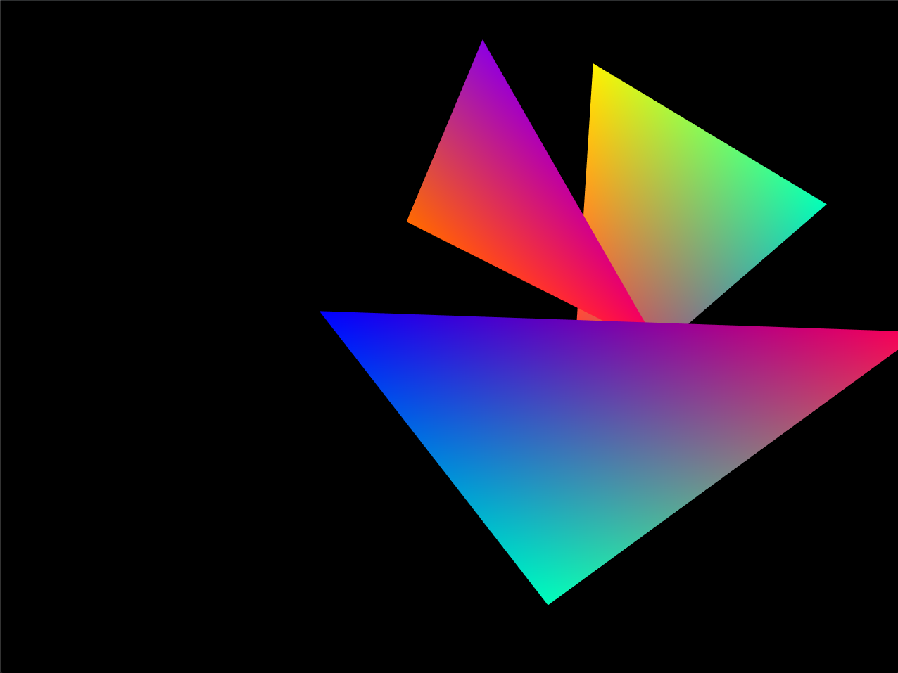

# Drawing Triangles with OpenGL

Using C++ and OpenGL, this program allows for a user to draw triangles, transform, and animate them. The user can also control the view's zoom and x-y position.

## Task 1.1 Triangle Soup Editor

  

After pressing the 'i' key, first two mouse clicks draws a line strip for the edges of the triangle. Third mouse click creates a red triangle.

The steps can be repeated to draw multiple triangles.

After pressing the 'o' key, triangles can be selected, with white border indicating they are selected. While the mouse left button is still pressed, the selected triangles can be moved

 

(note that this is accomplished in lines 468-482 of main.cpp. However those lines are commented out because subsequent tasks require that releasing the mouse button does not un-select the triangle. )

## Task 1.2 Rotate/Scale triangles

Selected triangles can then be rotated ('h'/'j' keys 10deg CW/CCW) and scaled ('k'/'l' keys +/-25%).

 

Rotation

 

Scale

## Task 1.3 Color vertices

After pressing the 'c' key, vertices of each triangle can be colored individually. When the mouse is clicked, the closest vertex to the mouse cursor changes to the color blue.

 

Pressing the numbers 1-9 on the keyboard then changes that vertex to various colors.

Colors are automatically interpolated between vertices by OpenGL.

## Task 1.4 View control

At any time during the program, 'w' 'a' 's' 'd' keys can shift the view **camera's position**, while '+'/'-' keys zoom in and out of the scene. This is done via shader uniform variables, rather than direct manipulation of vertices coordinates of objects in the scene.

    

Keys 'a' 'w' 'd' 's' pressed in that order.

 

Zooming in and out with '+' and '-' keys

## Task 1.5

After the user presses the 'm' key, they can draw triangles for an animation. Subsequent keyframes are made by pressing the '.' key. While they are free to rotate, translate, and color triangle vertices, after the first keyframe they cannot add any more triangles to the scene. When they are finished with the entire animation sequence, users can press the '/' key to see an animation loop interpolating between keyframes, with each keyframe one second apart.

