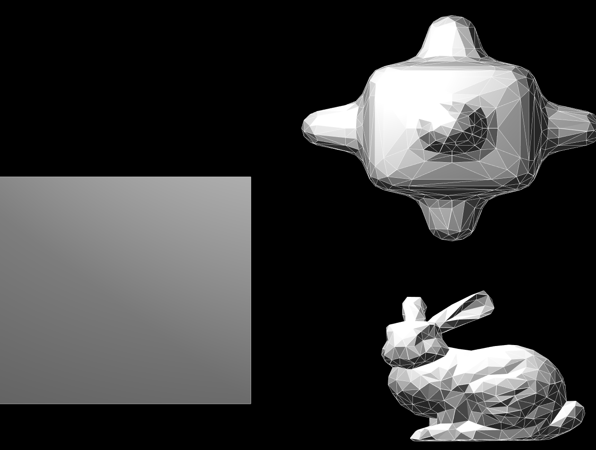
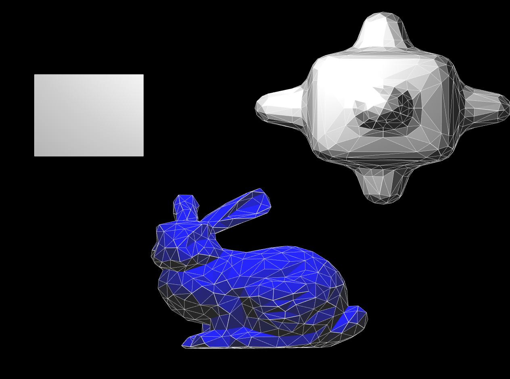
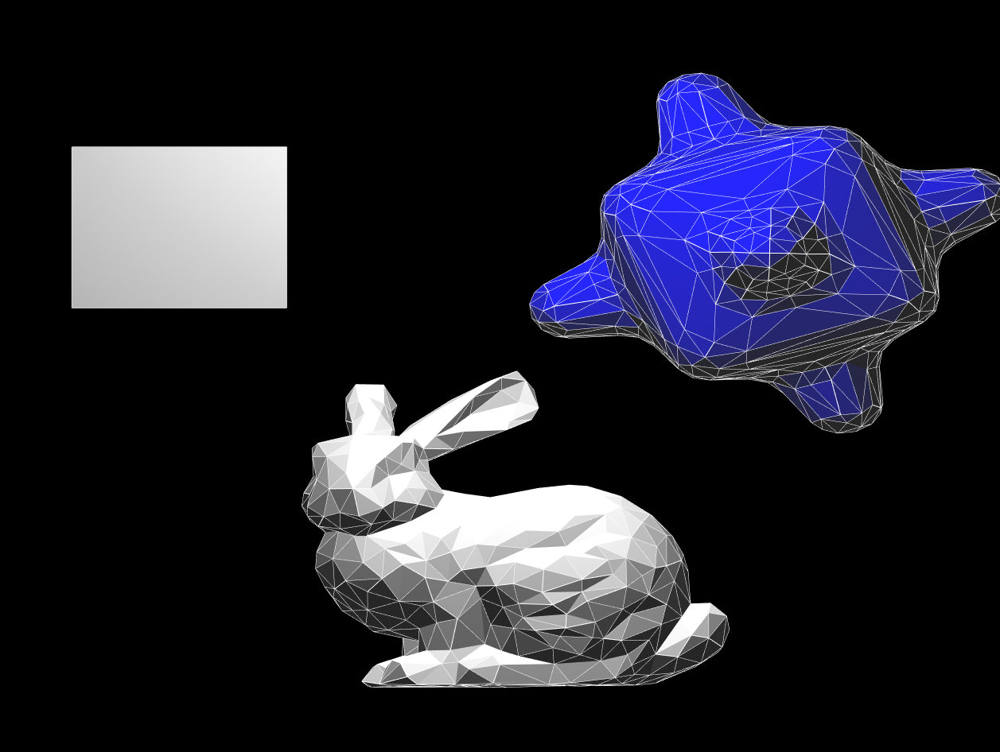
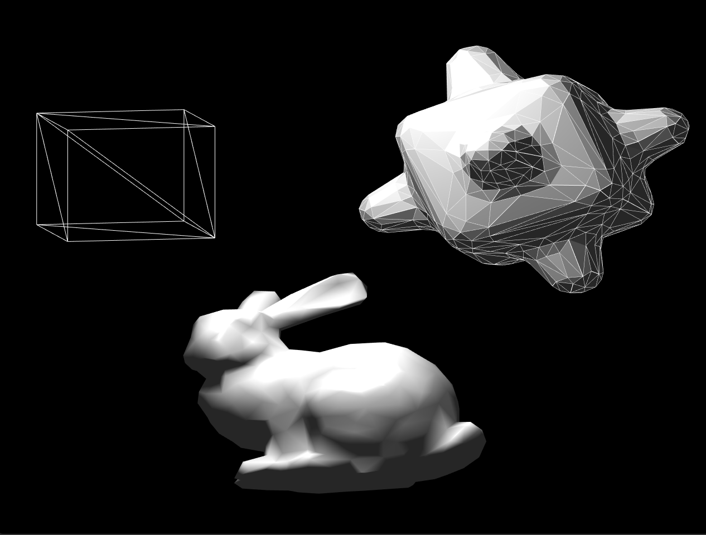
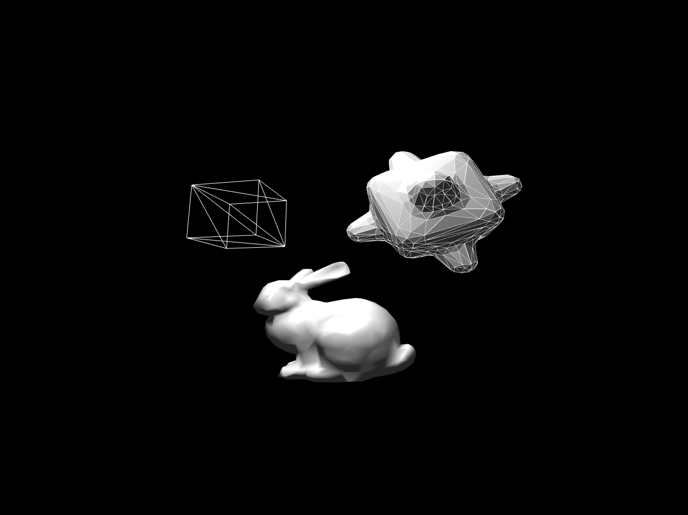

# Rendering Meshes with OpenGL

Using C++ and OpenGL, this program allows for a user to insert and modify meshes in orthographic and perspective view.

## Task 1.1 Scene Editor

Pressing 1, 2, 3 keys adds loaded meshes to the origin, scaled to a unit cube

## Task 1.2 Object Control / Render Style

Clicking on an object turns it blue. While the mouse button is clicked/pressed, the mesh will translate with the mouse. The following keys can be pressed to modify:

 - '.' / '/' keys **scales** the mesh
 - ';' / ' ' ' keys **rotates** the mesh
 - 'delete' / 'backspace' keys delete the mesh
 - 'j' 'k' 'l' keys  switch the render style from wireframe, flat, and phong shading styles respectively

## Task 1.3 Camera Control

'o' / 'p' keys switch between orthographic and perspective
'a' / 'd' moves the camera on the x-axis directions
'q' / 'z' moves the camera on the y-axis directions
'w' / 's' moves the camera on the z-axis directions

Gaze always points towards the origin.

# References

As always, *Fundamentals of Computer Graphics* by Marschner and Shirley was an invaluable resource.
